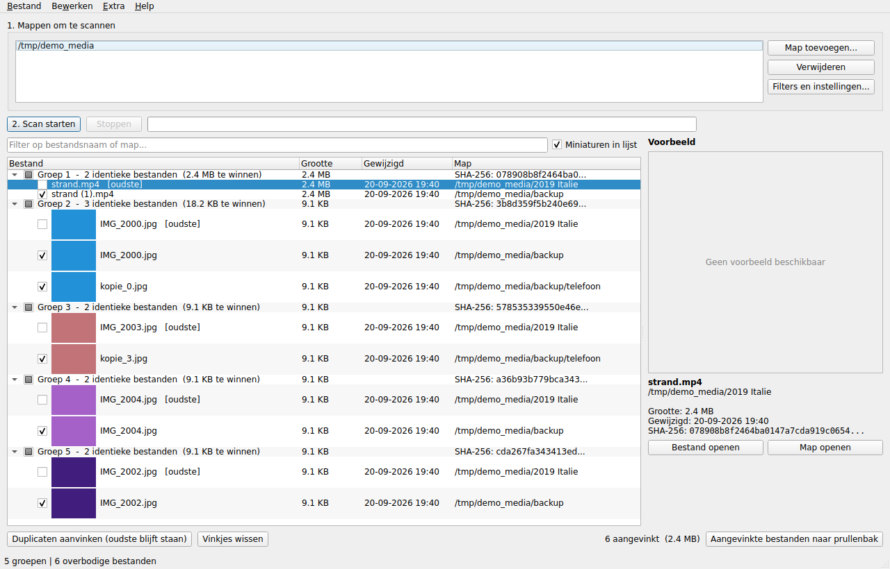

# Duplicate Media Finder

Vindt **exacte duplicaten** van foto's en video's in een map (inclusief submappen), toont ze in
een overzicht en laat je de kopieën naar de **Windows-prullenbak** verplaatsen of de map ervan
openen in **Verkenner**.

Gebouwd voor Windows 11, werkt ook op macOS en Linux.



*(Voorbeeldweergave; het uiterlijk volgt het thema van je systeem.)*

---

## Wat "exact duplicaat" hier betekent

Twee bestanden zijn pas een duplicaat als hun **volledige inhoud byte voor byte gelijk** is.
Dat wordt bepaald met SHA-256, in drie trappen van goedkoop naar duur:

| Trap | Controle | Waarom |
|------|----------|--------|
| 1 | Bestandsgrootte | Verschillende grootte = nooit identiek. Kost geen schijftoegang. |
| 2 | Hash van eerste en laatste 64 KB | Filtert vrijwel alle overblijvers weg zonder hele bestanden te lezen. |
| 3 | SHA-256 over het hele bestand | De definitieve uitspraak. |

**Gevolg:** geen valse positieven. Een foto die opnieuw is opgeslagen, bijgesneden of waarvan de
EXIF-datum is aangepast, is een *ander* bestand en wordt bewust niet als duplicaat gemeld.
Bestandsnaam, map en datum spelen geen enkele rol.

---

## Snel starten

### Optie A: kant-en-klare .exe downloaden (geen Python nodig)

Ga naar **[Releases](https://github.com/vdervalk/duplicate_media_files/releases)** en download
`DuplicateMediaFinder.exe`. Dubbelklikken en klaar.

Staat er nog geen release, start er dan zelf een build: tabblad **Actions** →
**Windows-build** → *Run workflow*. GitHub bouwt het bestand in een paar minuten op een
Windows-machine en zet het onder Releases.

> Windows toont mogelijk *"Windows heeft uw pc beveiligd"*, omdat de exe geen
> handtekening van een betaalde certificaatuitgever heeft. Klik op *Meer informatie* en
> daarna op *Toch uitvoeren*.

### Optie B: zelf een .exe bouwen

Eenmalig, met [Python 3.10 of nieuwer](https://www.python.org/downloads/windows/) geïnstalleerd:

```powershell
git clone https://github.com/vdervalk/duplicate_media_files.git
cd duplicate_media_files
.\build_exe.ps1
```

Resultaat: `dist\DuplicateMediaFinder.exe`. Dat bestand is zelfstandig, je kunt het overal
neerzetten en dubbelklikken. Python is daarna niet meer nodig.

> Krijg je "kan niet worden geladen omdat het uitvoeren van scripts is uitgeschakeld", start
> PowerShell dan eenmalig met:
> `powershell -ExecutionPolicy Bypass -File .\build_exe.ps1`

### Optie C: rechtstreeks met Python draaien

```powershell
python -m venv .venv
.venv\Scripts\activate
pip install -r requirements.txt
python run.py
```

Of dubbelklik daarna op `start.bat`.

---

## Gebruik in vier stappen

1. **Map kiezen** – klik op *Map toevoegen...* en selecteer bijvoorbeeld je externe schijf.
   Je kunt meerdere mappen tegelijk toevoegen; submappen gaan automatisch mee.
2. **Scan starten** – de voortgang per fase staat naast de balk. Stoppen mag altijd.
3. **Overzicht bekijken** – elke groep is één set identieke bestanden. Het oudste bestand staat
   bovenaan en is gemarkeerd met `[oudste]`. Klik een bestand aan voor een voorbeeld rechts.
4. **Opruimen** – vink aan wat weg mag en klik *Aangevinkte bestanden naar prullenbak*.

### Handige knoppen

| Actie | Wat het doet |
|-------|--------------|
| *Duplicaten aanvinken (oudste blijft staan)* | Vinkt in elke groep alles aan behalve het oudste bestand. |
| *Vinkjes wissen* | Zet alle vinkjes uit. |
| Dubbelklik op een bestand | Opent de map in Verkenner met het bestand geselecteerd. |
| Rechtermuisknop | Map openen, bestand openen, pad kopiëren, *Alleen dit bestand behouden*. |
| Filterveld | Toont alleen regels waarvan naam of map de ingetypte tekst bevat. |

### Sneltoetsen

| Toets | Actie |
|-------|-------|
| `Ctrl+O` | Map toevoegen |
| `Ctrl+D` | Duplicaten aanvinken |
| `Ctrl+Shift+D` | Vinkjes wissen |
| `Ctrl+C` | Geselecteerde paden kopiëren |
| `Ctrl+Del` | Aangevinkte bestanden naar prullenbak |
| `Ctrl+S` | Scanresultaat opslaan als JSON |

---

## Veiligheid

- **Niets wordt definitief gewist.** Bestanden gaan naar de systeemprullenbak en zijn daar
  terug te zetten.
- **Er blijft altijd één exemplaar staan.** Vink je per ongeluk een hele groep aan, dan wordt
  het oudste bestand automatisch overgeslagen en krijg je dat te zien in het
  bevestigingsvenster.
- **Bevestiging vooraf** met het aantal bestanden, de vrij te maken ruimte en (onder *Details*)
  de volledige lijst paden.
- **Alleen lezen tijdens het scannen.** De scan wijzigt nooit iets aan je bestanden.

---

## Ondersteunde bestandsformaten

**Foto's**
`jpg` `jpeg` `jpe` `jfif` `png` `gif` `bmp` `tif` `tiff` `webp` `heic` `heif` `avif` `ico`
en camera-raw: `cr2` `cr3` `crw` `nef` `nrw` `arw` `srf` `sr2` `dng` `orf` `rw2` `raf` `pef`
`raw` `3fr` `erf` `kdc` `mrw` `x3f`

**Video's**
`mp4` `m4v` `mov` `qt` `avi` `mkv` `webm` `wmv` `asf` `flv` `f4v` `mpg` `mpeg` `mpe` `m2v`
`mts` `m2ts` `ts` `vob` `3gp` `3g2` `mxf` `ogv` `rm` `rmvb` `divx`

Zelf iets toevoegen kan onder *Filters en instellingen* → *Extra extensies*. Wil je juist maar
één type scannen, vul dan *Alleen deze extensies* in.

> De vergelijking werkt voor **elk** formaat, ook formaten die hier niet staan: er wordt naar
> bytes gekeken, niet naar beeldinhoud. De lijst bepaalt alleen wélke bestanden meedoen.

---

## Filters en instellingen

| Instelling | Nut |
|------------|-----|
| Foto's / video's | Schakel een hele categorie uit. |
| Minimale grootte | Sla miniaturen en `.thumb`-rommel over (bijvoorbeeld < 50 KB). |
| Maximale grootte | Handig om eerst alleen kleine bestanden te doen. |
| Mapnamen overslaan | Standaard o.a. `$RECYCLE.BIN`, `System Volume Information`, `@eaDir`. |
| Specifieke mappen overslaan | Bijvoorbeeld een map die je bewust dubbel bewaart. |
| Verborgen en systeembestanden | Standaard aan; laat Windows-rommel buiten beschouwing. |
| Hashcache | Bewaart berekende hashes, zodat een tweede scan van dezelfde schijf vrijwel gratis is. |
| Parallelle leesthreads | Voor een externe USB-schijf is 4 tot 8 doorgaans het snelst, voor een SSD mag het hoger. |

Instellingen worden automatisch bewaard en bij de volgende start teruggezet.

---

## Resultaten bewaren en exporteren

- **Scanresultaat opslaan (JSON)** – het complete resultaat, later weer in te laden via
  *Bestand → Scanresultaat laden*. Bestanden die inmiddels weg zijn, krijgen het label
  *(niet gevonden)*.
- **Exporteren naar CSV** – één regel per bestand, met puntkomma's en BOM zodat Excel de kolommen
  meteen goed zet. Kolommen: groep, hash, rol (origineel/duplicaat), bestand, map, volledig pad,
  grootte, gewijzigd, type.

---

## Waar staat wat

| Wat | Locatie (Windows) |
|-----|-------------------|
| Instellingen | `%APPDATA%\DuplicateMediaFinder\settings.json` |
| Hashcache | `%APPDATA%\DuplicateMediaFinder\hashcache.sqlite3` |
| Miniaturen | `%APPDATA%\DuplicateMediaFinder\thumbnails\` |

Beide caches zijn te wissen via het menu *Extra*. Ze bevatten alleen paden, hashes en kleine
voorbeeldplaatjes.

---

## Snelheid

De eerste scan van een volle externe schijf is I/O-gebonden: de tijd zit in het lezen van
bestanden die in grootte overeenkomen. Wat helpt:

- **Hashcache aan laten.** Een tweede scan leest vrijwel niets meer.
- **Minimale grootte instellen** als je map vol `.thumbnails` of `.aae`-bestanden staat.
- **Threads afstemmen:** USB-schijf 4-8, interne SSD 8-16.

Alleen bestanden met een gedeelde bestandsgrootte worden gelezen. Een unieke bestandsgrootte
kost nul schijftoegang.

---

## Ontwikkeling

```bash
pip install -r requirements-dev.txt
pytest                       # 54 tests: hashing, scanner, export, acties, GUI
```

De GUI-tests draaien headless (`QT_QPA_PLATFORM=offscreen`).

### Structuur

```
dupefinder/
  config.py       scaninstellingen + opslaan/laden
  formats.py      ondersteunde extensies
  hashing.py      partiële en volledige hash, byte-vergelijking
  cache.py        SQLite-hashcache
  scanner.py      doorzoeken, groeperen, voortgang, annuleren
  actions.py      verwijderplan, prullenbak, Verkenner
  exporter.py     JSON/CSV opslaan en laden
  thumbnails.py   miniaturen (Pillow, HEIC, videoframe via ffmpeg)
  gui/            hoofdvenster, instellingendialoog, achtergrondtaken
```

Alle logica buiten `gui/` werkt zonder Qt en is los te gebruiken in scripts.

---

## Bekende beperkingen

- **Geen visueel gelijkende beelden.** Dezelfde foto in een andere resolutie of met andere
  compressie wordt niet gevonden; dat is per definitie geen exact duplicaat.
- **Voorbeeld van RAW-bestanden** lukt niet altijd: Pillow kan de meeste RAW-formaten niet
  uitpakken. De vergelijking zelf werkt wel gewoon.
- **Videominiaturen** vereisen `imageio-ffmpeg` (zit in `requirements.txt` en wordt meegebakken
  in de .exe). Zonder ffmpeg toont het voorbeeldvenster "Geen voorbeeld beschikbaar".
- **Netwerkschijven** werken, maar zijn traag: elk kandidaatbestand moet over het netwerk
  gelezen worden.
